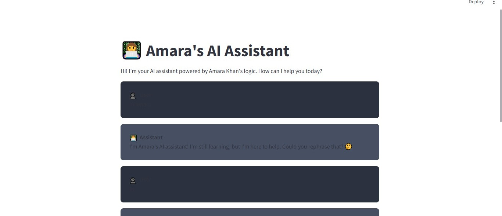
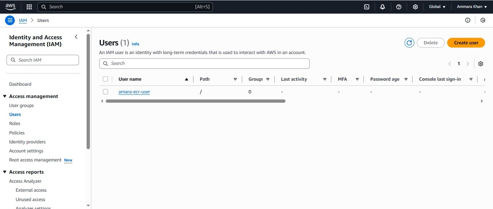
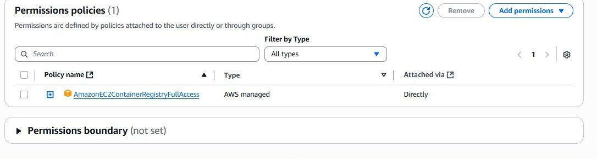
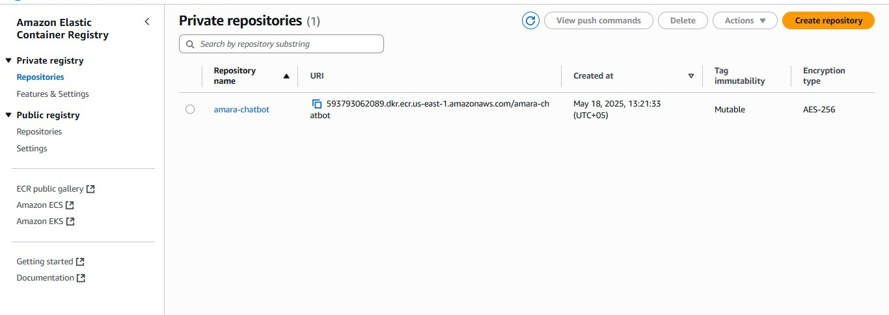
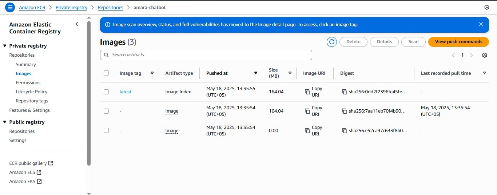

# Amara's AI Assistant Chatbot 🤖

A modern, containerized chatbot application built with Streamlit and Docker, ready for deployment to AWS ECR and EC2.

## 📸 Application Screenshots

### Chat Interface

*The main chat interface with message bubbles and emoji support*

## 🔐 AWS Setup Guide

### IAM User Configuration

*Creating an IAM user with appropriate permissions*

### IAM Policy Setup

*Configuring IAM policies for ECR access*

### AWS ECR Repository

*Setting up the Elastic Container Registry repository*

### ECR Image Push

*Pushing Docker image to ECR repository*

## 🌟 Features

[Rest of the README remains the same...]
